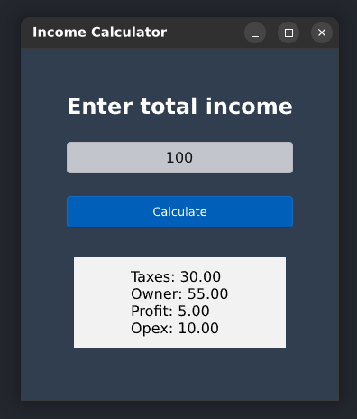

# Rust Slint Desktop App Tutorial

A simple income calculator desktop application built using [Rust](https://www.rust-lang.org/) and [Slint](https://slint-ui.com/) UI toolkit. This project was created as a learning exercise to explore Rust programming and Slint for building cross-platform desktop user interfaces.

## Project Overview

This application is a basic income calculator that:
- Takes a total income amount as input
- Calculates the distribution of income across different categories:
  - Taxes (30%)
  - Owner payment (55%)
  - Profit (5%)
  - Operating expenses (10%)
- Displays results with an animated "curtain" effect

## Screenshots



## Prerequisites

- [Rust](https://www.rust-lang.org/tools/install) (stable version)
- Cargo package manager (comes with Rust)
- Development dependencies for Slint (see [Slint requirements](https://slint-ui.com/releases/1.0.0/docs/install/))

## Getting Started

1. Clone this repository:
   ```bash
   git clone [repository-url]
   cd rust-slint-desktop-app
   ```

2. Build the project:
   ```bash
   cargo build
   ```

3. Run the application:
   ```bash
   cargo run
   ```

## Project Structure

- `src/main.rs` - Main Rust code handling income calculations and UI logic
- `ui/appwindow.slint` - Slint UI definition for the application window
- `build.rs` - Build script for compiling Slint UI files

## What I Learned

- Basic Rust programming concepts
- Setting up a Rust project with Cargo
- Using the Slint UI toolkit for desktop application development
- Creating responsive UI components
- Implementing animations in Slint
- Connecting Rust backend logic with UI components

## Technologies Used

- Rust 2021 Edition
- Slint 1.0 UI toolkit
- Cargo build system

## License

This project is open source and available under the [LICENSE](./LICENSE) file included in this repository.

## Acknowledgements

- [Slint Documentation](https://slint-ui.com/docs/rust/slint/)
- [Rust Book](https://doc.rust-lang.org/book/)